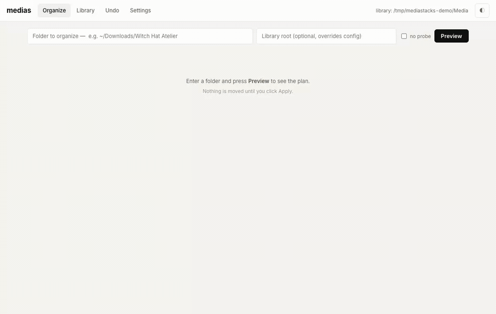
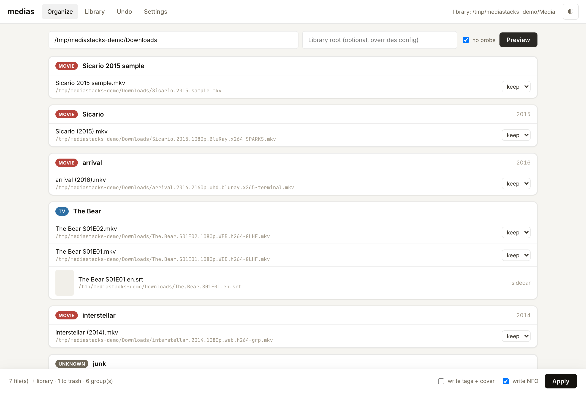
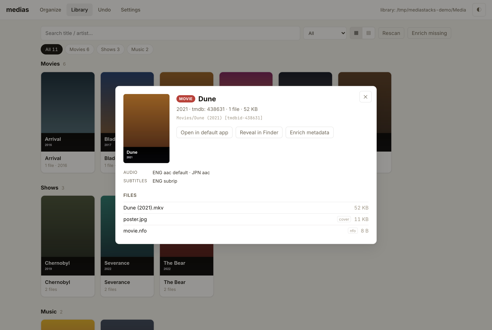
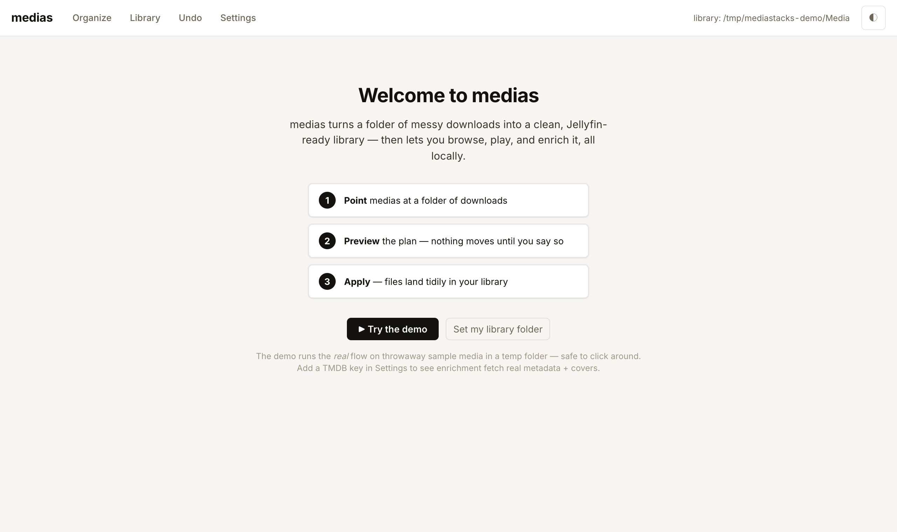
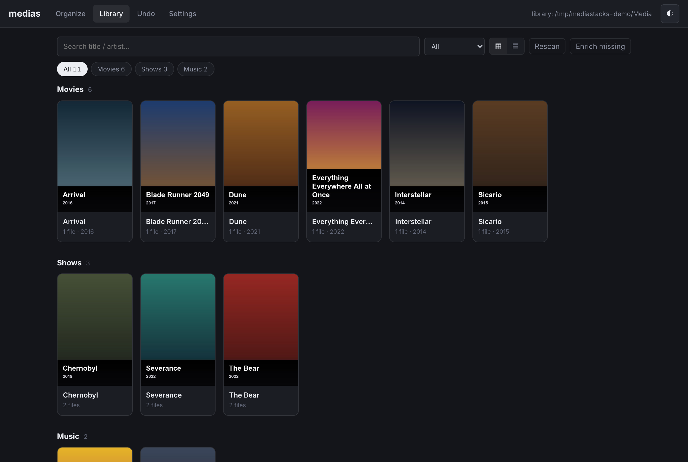

<div align="center">

# mediastacks

### Turn a folder of messy downloads into a clean, Jellyfin-ready media library — then browse, play, and enrich it. All local. All yours.

[](https://ziglang.org)
[](#install)
[](#what-it-does)
[](#why)

<br/>



</div>

## What it does

**`medias`** points at your download folder and turns this…

```
Sicario.2015.1080p.BluRay.x264-SPARKS.mkv
The.Bear.S01E01.1080p.WEB.h264-GLHF.mkv
The.Bear.S01E01.en.srt
arrival.2016.2160p.uhd.bluray.x265-terminal.mkv
RARBG.txt
```

…into a tidy, player-ready library — grouped, de-duplicated, correctly named, subtitles language-tagged, junk swept aside:

```
Movies/Sicario (2015)/Sicario (2015).mkv
Shows/The Bear/Season 01/The Bear S01E01.mkv
Shows/The Bear/Season 01/The Bear S01E01.en.srt
Movies/Arrival (2016)/Arrival (2016).mkv
```

Then it hands you a **local web app** to browse the result with covers, play files inline, fetch posters + metadata, and undo anything — no cloud account, no library scanner phoning home.

It ships alongside **`biblio`**, a sibling tool for organizing and reading books & comics (EPUB / MOBI / AZW3 / PDF / CBZ / CBR).

## Highlights

- **Preview-first & fully reversible** — nothing moves until you approve the plan; every run is one click to undo.
- **Kind-aware organizing** — TV, movies, music, audiobooks, and comics, each with its own parser and Jellyfin/Kodi naming.
- **Browse & play in the browser** — a fast local UI with cover art, search, filters, and inline audio/video playback.
- **Enrichment** — pull canonical metadata + poster/cover art from **TMDB** and **MusicBrainz**, written as NFO + image sidecars.
- **Subtitles & languages** — subtitle sidecars get Jellyfin language tags (`Movie (2021).en.srt`, `.forced`, `.sdh`); audio & subtitle track languages surface in the detail view.
- **Local-first & private** — one SQLite catalog on disk, filesystem is the source of truth, zero telemetry.
- **Safe to try** — `medias serve --demo` spins up a throwaway sandbox with sample media so you can click around risk-free.
- **Tiny & dependency-light** — written in Zig, SQLite vendored in-tree, deletes go to a trash dir, and it cross-compiles to a single binary.

## Screenshots

|  |  |
| :---: | :---: |
| **See every move before it happens** | **Rich detail — with audio & subtitle tracks** |
|  |  |
| **First-run onboarding + a safe demo** | **Light & dark, your call** |
|  |  |

## Install

**Prebuilt (macOS / Linux):**

```sh
curl -fsSL https://raw.githubusercontent.com/markussagen/mediastacks/main/scripts/install.sh | bash
```

Downloads the latest release for your platform, verifies its checksum, and installs `medias` + `biblio` (to `/usr/local/bin`, or `~/.local/bin`). Pin a version with `MEDIASTACKS_VERSION=v1.2.3`, choose a dir with `--dir ~/bin`. Then install the runtime libraries once:

```sh
brew install libmobi libxml2 sqlite                 # macOS
sudo apt install libmobi-dev libxml2 libsqlite3-0   # Debian / Ubuntu
```

Or grab a tarball from the [releases page](https://github.com/markussagen/mediastacks/releases).

**Homebrew:**

```sh
brew install markussagen/mediastacks/mediastacks
```

**Chocolatey (Windows):**

```powershell
choco install mediastacks
```

**Nix:** `nix develop` gives a reproducible build shell (Zig 0.16 + the C deps) — see [`flake.nix`](./flake.nix).

**Windows:** `medias` runs on Windows (built + smoke-tested in CI); `biblio` is macOS/Linux only. Packaging details in [`docs/PACKAGING.md`](./docs/PACKAGING.md).

## Quick start

```sh
medias serve --demo          # explore a sandbox — nothing on your disk is touched
# → open http://127.0.0.1:8799

medias organize ~/Downloads --dry-run   # preview the plan for real files
medias organize ~/Downloads             # apply it (reversible)
medias undo                             # changed your mind
```

Add a free [TMDB API key](https://www.themoviedb.org/settings/api) in **Settings** and hit **Enrich** to pull real metadata and cover art.

### How it works

1. **Point** `medias` at a folder of downloads.
2. **Preview** the plan — grouped, renamed, de-duplicated. Nothing moves until you say so.
3. **Apply** — files land tidily in your library, ready for Jellyfin, Kodi, or Plex.

## Build from source

```sh
mise install                         # Zig 0.16 + zls (see .tool-versions)
zig build                            # → ./zig-out/bin/{medias,biblio}
zig build -Doptimize=ReleaseFast     # optimized
zig build test                       # unit tests
zig build run-medias -- serve        # build + run medias
```

**Requirements:** Zig 0.16 (managed via [mise](https://mise.jdx.dev)); SQLite is vendored, so `medias` needs no system C libraries. `biblio` additionally links **libmobi** (`brew install libmobi`) and **libxml2** (macOS SDK / `apt install libxml2-dev`). Optional: `ffmpeg`/`ffprobe` for media inspection, `chafa` for terminal cover previews, `sevenzip` for CBR/CB7/CBT.

## Documentation

- [`docs/COMMANDS.md`](./docs/COMMANDS.md) — every CLI subcommand
- [`docs/WEB.md`](./docs/WEB.md) — the web UI: routes, frontend, customization
- [`docs/TUI.md`](./docs/TUI.md) — the terminal reader: keybindings, EPUB pipeline

## Why

Media servers are great at *serving* a library and terrible at *building* one. Existing renamers are either heavyweight, cloud-tied, or fire-and-forget with no preview. `mediastacks` is the opposite: small, local, preview-first, reversible, and honest about what it's about to do — the tool you actually want between "downloaded a pile of files" and "it just shows up correctly in Jellyfin."

<div align="center"><sub>Built in Zig. Local-first. No cloud, no accounts, no telemetry.</sub></div>
